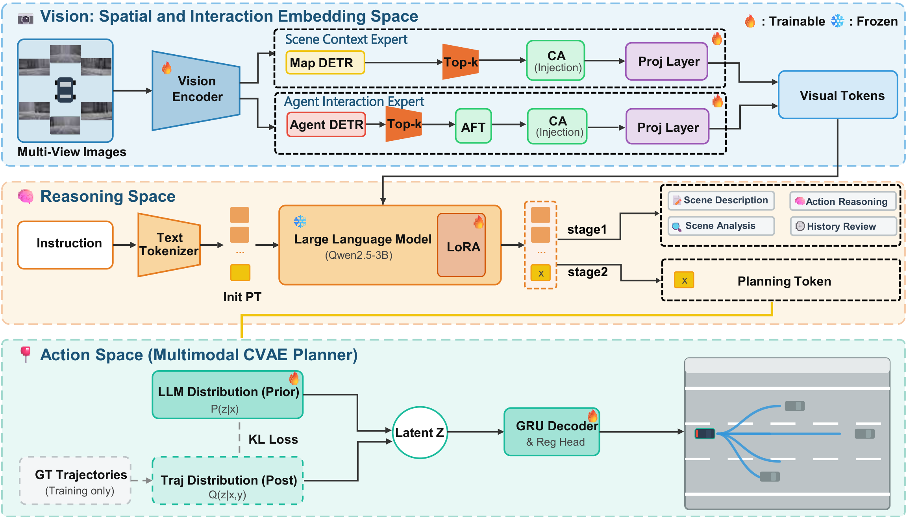

<div align="center">

# INSPIRE-VLA: Interaction and Spatial-Reinforced Vision-Language-Action Model for Autonomous Driving

<a href="https://github.com/pykkll/INSPIRE-VLA"></a>
<!-- <a href="https://arxiv.org/abs/XXXX.XXXXX"></a> -->

</div>

---

## Abstract

Vision-Language-Action (VLA) models have shown immense potential in autonomous
driving with promising semantic understanding and reasoning capabilities of
Vision Language Models (VLMs). However, existing VLA paradigms deteriorate in
complex and interactive scenarios, due to their limitations inherited from
VLMs: **inadequate spatial understanding** and **limited interaction
comprehension**. To address these issues, we propose **INSPIRE-VLA**, an
end-to-end VLA autonomous driving framework with explicit spatial and
interaction reinforcement.

INSPIRE-VLA employs a **spatial-interaction-aware mixture-of-transformers**
design: using the input images, a **Scene Context Expert** embeds spatial
priors of static scenes, while an **Agent Interaction Expert** dynamically
encodes multi-agent interactions. Such spatial and interaction cues are used to
effectively guide the tactical reasoning of the VLM to generate
spatial-interaction-aware semantic planning tokens, which are decoded by a
proposed **multi-modal planning expert** into feasible and multi-modal
trajectories. Extensive evaluations demonstrate that the proposed framework
outperforms existing baselines in terms of closed-loop planning performance,
with the highest **Driving Score (92.48)** and **Success Rate (82.27%)**,
showcasing the advantage of spatial and interaction enhancement.

## Overview

<div align="center">

</div>

The framework is built upon a synergistic **mixture-of-transformers** design.
It first extracts multi-view features from images and explicitly encodes static
scene geometries and dynamic multi-agent interactions via the proposed **Scene
Context Expert (SCE)** and **Agent Interaction Expert (AIE)**. Along with
instruction tokens, such spatial-interaction-embedded tokens are integrated to
provide effective guidance to the LLM, which performs spatial-interaction-aware
scene understanding and tactical reasoning. Conditioned on the LLM-generated
planning token, a proposed **multi-modal CVAE planner** decodes the semantic
tokens into multi-modal feasible trajectories.

## Highlights

- **INSPIRE-VLA**, a holistic end-to-end VLA autonomous driving framework
  enhanced with scene spatial and agentic interaction priors, providing
  spatial-interaction-aware reasoning along with the inherited semantic
  grounding of VLMs.
- A **spatial-aware mixture-of-transformer** mechanism that explicitly embeds
  scene topology-geometry and agentic interaction priors from multi-view
  images, offering fine-grained spatial-interaction guidance to the reasoning
  of the VLM.
- Extensive experiments on the **Bench2Drive** benchmark show that INSPIRE-VLA
  outperforms state-of-the-art VLA AD models, achieving notable improvement on
  closed-loop planning performance in complex and interactive scenarios.

## Results

### Closed-loop performance on Bench2Drive

`*` denotes expert feature distillation.

| Method | DS ↑ | SR (%) ↑ | Efficiency | Merging | Overtake | Brake | Give-Way | Traffic-Sign | Mean |
| :--- | :---: | :---: | :---: | :---: | :---: | :---: | :---: | :---: | :---: |
| TCP* | 40.70 | 15.00 | 54.26 | 16.18 | 20.00 | 20.00 | 10.00 | 6.99 | 14.63 |
| TCP-ctrl* | 30.47 | 7.27 | 55.97 | 10.29 | 4.44 | 10.00 | 10.00 | 6.45 | 8.23 |
| TCP-traj* | 59.90 | 30.00 | 76.54 | 8.89 | 24.29 | 51.67 | 40.00 | 46.28 | 34.22 |
| ThinkTwice* | 62.44 | 31.23 | 69.33 | 27.38 | 18.42 | 35.82 | 50.00 | 54.23 | 37.17 |
| DriveAdapter* | 64.22 | 33.08 | 70.22 | 28.82 | 26.38 | 48.76 | 50.00 | 56.43 | 42.08 |
| AD-MLP | 18.05 | 0.00 | 48.45 | 0.00 | 0.00 | 0.00 | 0.00 | 4.35 | 0.87 |
| UniAD-Tiny | 40.73 | 13.18 | 123.92 | 8.89 | 9.33 | 20.00 | 20.00 | 15.43 | 14.73 |
| UniAD-Base | 45.81 | 16.36 | 129.21 | 14.10 | 17.78 | 21.67 | 10.00 | 14.21 | 15.55 |
| VAD | 42.35 | 15.00 | 157.94 | 8.11 | 24.44 | 18.64 | 20.00 | 19.15 | 18.07 |
| DriveTransformer | 63.46 | 35.01 | 100.64 | 17.57 | 35.00 | 48.36 | 40.00 | 52.10 | 38.60 |
| DriveMoE | 74.22 | 48.64 | 175.96 | 34.67 | 40.00 | 65.45 | 40.00 | 59.44 | 47.91 |
| Orion | 77.74 | 54.62 | 151.48 | 25.00 | 71.11 | 78.33 | 30.00 | 69.15 | 54.72 |
| AutoVLA | 78.84 | 57.73 | 146.93 | - | - | - | - | - | - |
| SimLingo | 85.07 | 67.27 | 259.23 | 53.75 | 68.89 | 81.67 | 50.00 | 82.11 | 67.28 |
| **INSPIRE-VLA (Ours)** | **92.48** | **82.27** | 139.40 | 63.75 | 97.78 | 88.33 | 100.00 | 86.84 | 87.34 |

INSPIRE-VLA outperforms state-of-the-art baselines by a large margin, achieving
the highest Driving Score and Success Rate of **92.48** and **82.27%**,
respectively. Compared with previous expert-distillation methods such as
DriveAdapter, which heavily rely on privileged expert features, our
vision-based framework demonstrates an improvement of **+28.26 DS**.
Furthermore, INSPIRE-VLA outperforms the latest baseline SimLingo by
**+7.41 DS / +15.00% SR**, showcasing the advantage of spatial and interaction
enhancement over purely implicit vision-language reasoning.

In the granular multi-ability evaluation, INSPIRE-VLA achieves success rates of
**100.00%** (Give-Way) and **97.78%** (Overtaking), and outperforms SOTA
frameworks in all other tasks.

### Ablation study

| Model Config | SCE | AIE | DS ↑ | SR ↑ |
| :--- | :---: | :---: | :---: | :---: |
| Vanilla VLA | | | 91.45 | 77.27% |
| w/ SCE Only | ✓ | | 92.18 | 79.09% |
| w/ AIE Only | | ✓ | 91.89 | 79.55% |
| **Full INSPIRE-VLA** | ✓ | ✓ | **92.48** | **82.27%** |


## Getting Started

```bash
git clone git@github.com:pykkll/INSPIRE-VLA.git
cd INSPIRE-VLA
conda create -n inspire python=3.8 -y
conda activate inspire
pip install torch==2.4.1+cu118 torchvision==0.19.1+cu118 torchaudio==2.4.1 --index-url https://download.pytorch.org/whl/cu118
pip install -v -e .
pip install -r requirements.txt
```

## Data and Weights Preparation

1. Prepare the **Bench2Drive** dataset following the official
   [Bench2DriveZoo DATA_PREP](https://github.com/Thinklab-SJTU/Bench2DriveZoo/blob/uniad/vad/docs/DATA_PREP.md)
   guide, and put it under the `data/` directory:

   ```bash
   cd /path/to/INSPIRE-VLA
   mkdir -p ckpts data
   ```

2. Download the pre-trained **2D LLM weights** and the **vision encoder +
   projector weights**
   ([eva02_petr_proj.pth](https://github.com/NVlabs/OmniDrive/releases/download/v1.0/eva02_petr_proj.pth),
   from [OmniDrive](https://github.com/NVlabs/OmniDrive/tree/main)) into
   `ckpts/`.

3. The **Chat-B2D** instruction dataset used for stage-1 vision-language
   alignment is available at
   [Chat-B2D](https://huggingface.co/datasets/poleyzdk/Chat-B2D/tree/main):

   ```bash
   unzip Chat-B2D.zip -d data/
   ```

## Training (two-stage)

INSPIRE-VLA is optimized with a **two-stage** strategy to prevent gradient
conflicts between semantic reasoning and explicit spatial encoding.

- **Stage 1 — Vision-Language Alignment.** The CVAE planner and the explicit
  spatial injection of the AIE/SCE are deactivated; the AIE and SCE act as
  basic visual perception encoders. The model is optimized by
  `L_perc + L_llm`, focusing on grounding 2D visual inputs to the LLM semantic
  space and on standard QA tasks.
- **Stage 2 — End-to-End Planning.** The visual backbone is frozen and QA text
  generation is omitted. The spatial injection mechanisms of the AIE and SCE
  are fully activated, and the model is supervised by `L_plan + L_perc`.

```bash
# Stage 1
./adzoo/inspire/inspire_dist_train.sh adzoo/inspire/configs/inspire_stage1_train.py $GPUS

# Stage 2 (set load_from in the config to the stage-1 checkpoint)
./adzoo/inspire/inspire_dist_train.sh adzoo/inspire/configs/inspire_stage2_train.py $GPUS
```

All experiments are conducted on 7 NVIDIA L40S GPUs, using the AdamW optimizer
with a cosine learning-rate schedule and a peak learning rate of `6e-5`. Stage 2
jointly optimizes the trainable components of the end-to-end planning pipeline
for 6 epochs.

## Evaluation

### Open-loop evaluation

```bash
./adzoo/inspire/inspire_dist_eval.sh adzoo/inspire/configs/inspire_stage3_infer.py [CHECKPOINT] 1
```


```bash
./adzoo/inspire/inspire_dist_eval.sh adzoo/inspire/configs/inspire_stage3_fp16.py [CHECKPOINT] 1
```

### Closed-loop evaluation

Refer to [Bench2Drive](https://github.com/Thinklab-SJTU/Bench2Drive) to clone
the evaluation tools and prepare CARLA, then follow the
[eval tools guide](https://github.com/Thinklab-SJTU/Bench2Drive?tab=readme-ov-file#eval-tools).

Set `GPU_RANK`, `TEAM_AGENT` and `TEAM_CONFIG` in the eval scripts as follows:

```bash
TEAM_AGENT=team_code/inspire_b2d_agent.py
TEAM_CONFIG=adzoo/inspire/configs/inspire_stage3_agent.py+[CHECKPOINT_PATH]
```

> **Note.** `team_code/inspire_b2d_agent.py` imports its helpers as
> `from inspire.team_code.pid_controller import ...`, i.e. this repository must
> be placed (or symlinked) under the Bench2Drive working directory with the
> package name `inspire`.

## Citation

This paper is currently under review. The citation will be added once it is
published.

## Acknowledgement

This project is built on the following open-source resources. We thank their
authors for releasing them:

- [Bench2Drive](https://github.com/Thinklab-SJTU/Bench2Drive) /
  [Bench2DriveZoo](https://github.com/Thinklab-SJTU/Bench2DriveZoo) — the
  closed-loop benchmark and evaluation tools.
- [OmniDrive](https://github.com/NVlabs/OmniDrive) — pre-trained vision encoder
  and projector weights.
- [Chat-B2D](https://huggingface.co/datasets/poleyzdk/Chat-B2D) — the
  instruction-tuning dataset.
- [MMCV](https://github.com/open-mmlab/mmcv) — the training infrastructure
  bundled in `mmcv/`.

## License

This project is released under the [Apache License 2.0](LICENSE).
